# 🧵 ChohanTextile

A full-featured **React Native e-commerce mobile app** powered by **Firebase** for backend and **Stripe** for payments.

---

## 🚀 Features

### 👨‍💼 Admin
- Admin can log in.
- Admin can add products.
- Admin can edit products.
- Admin can delete products.

### 🛍️ Customer
- Sign up using Firebase Authentication.
- Login using Firebase Authentication.
- Reset password via Firebase.
- View product descriptions.
- Add products to cart.
- Checkout cart.
- Make payments via Stripe.
- Filter products by category.
- Search for products.
- View linked social media pages.
- View order history.

---

## 🛠️ Technologies Used
- **React Native** (Expo)
- **Firebase** (Auth, Realtime DB, Storage)
- **Node.js** (Express server for Stripe)
- **Stripe** (for secure payments)

## 🧪 How to Run the Project

### 📱 1st Step: Start Mobile App

- cd chohan-textile
- npm install 
- expo install expo-router expo-image-picker expo-status-bar
- npm install firebase @stripe/stripe-react-native
- npm install react-native-vector-icons react-native-svg
- npx expo start

## 🌐 2nd Step: Start Stripe Server
- cd stripe-server
- npm install express stripe cors dotenv
- node server.js

---

## 📸 Screenshots

### 🏠 Home Screen

  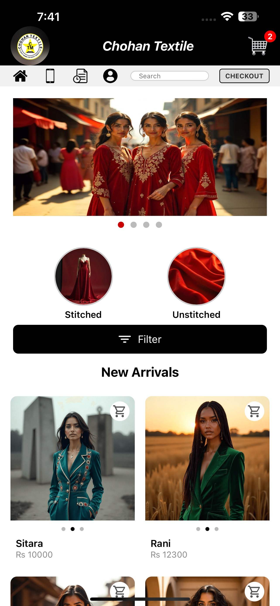

### 📦 Product List

  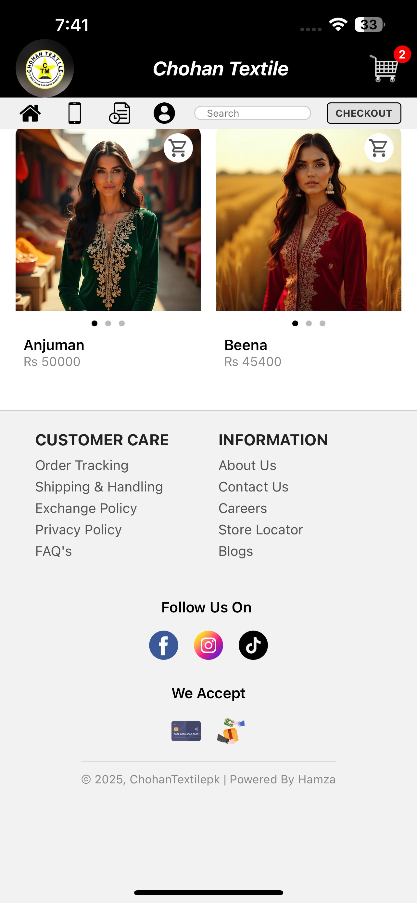

### 💰 Filter by Price

  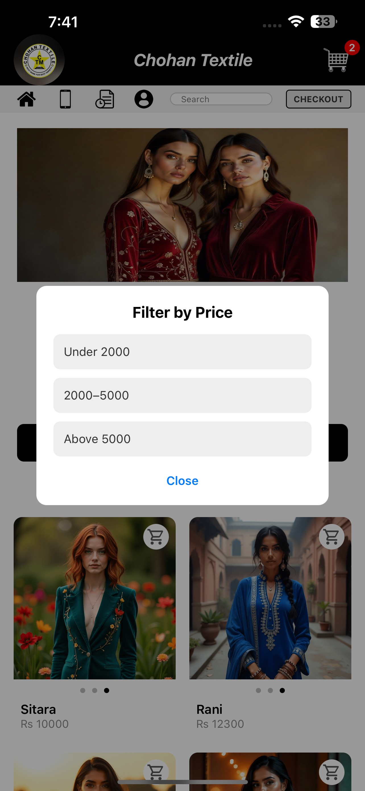

### 🧵 Filter by Category

  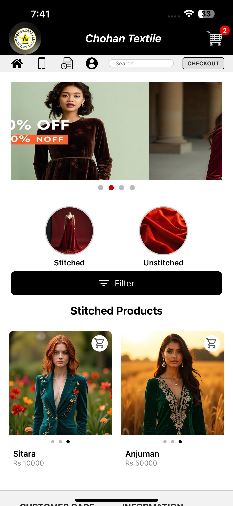

### 🛒 Product Cart

  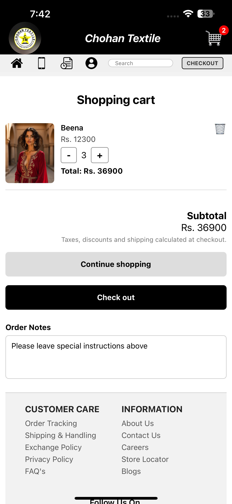

### 💳 Checkout

  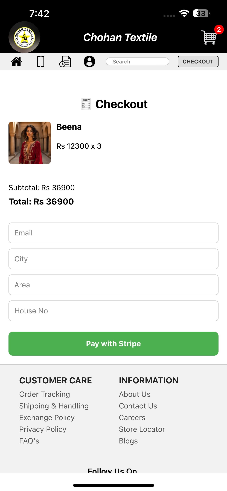

### 🧾 Stripe Payment

  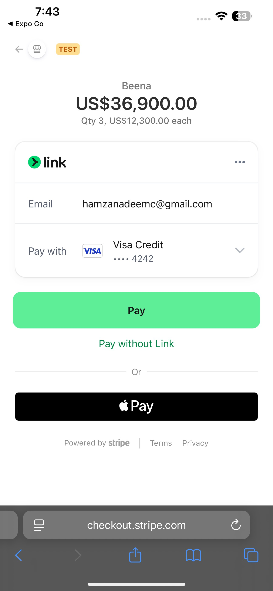

### ☎️ Call Support Page

  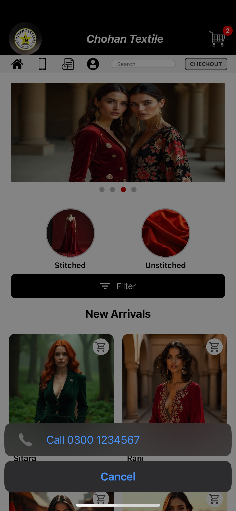

### 📜 Order History

  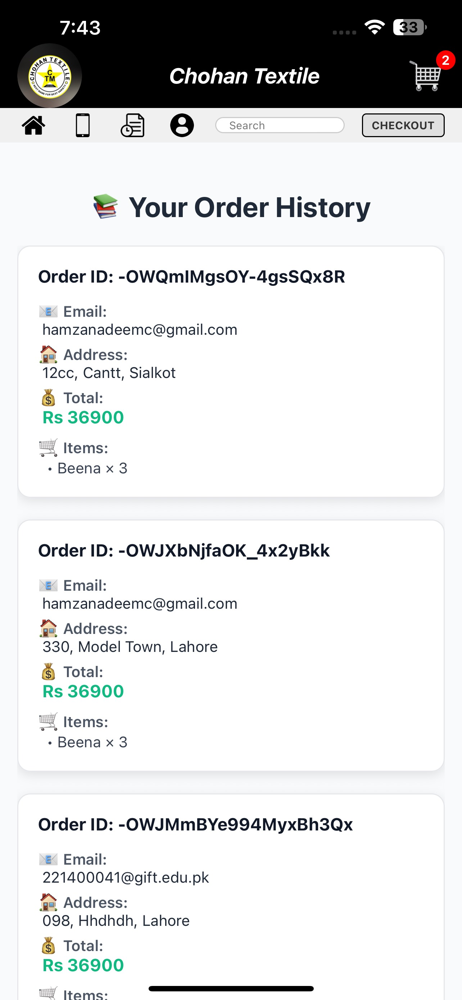

---

## 👥 Authentication Screens

### 🔑 Login Selection

  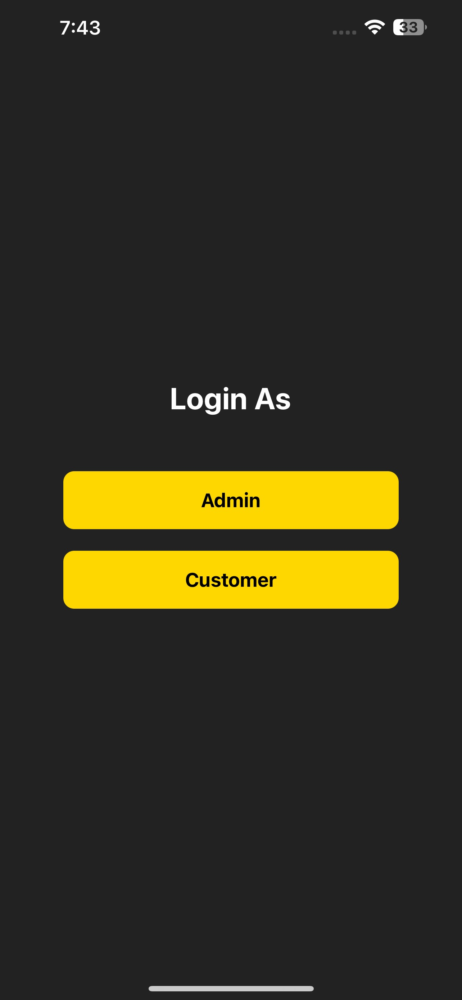

### 🧍 Customer Signup

  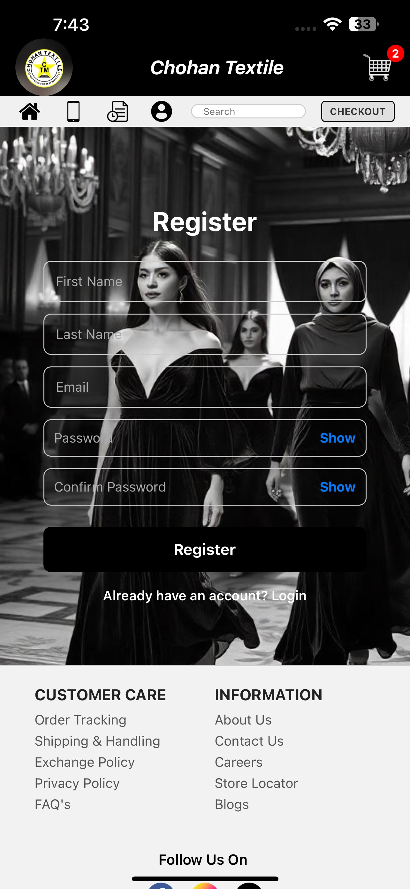

### 🔄 Reset Password

  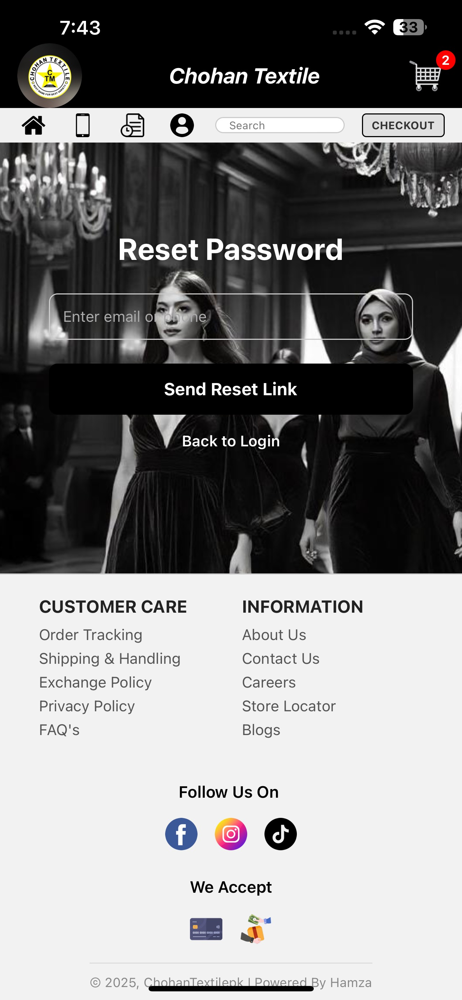

---

## 🛠️ Admin Screens

### 🗃️ Manage Products

  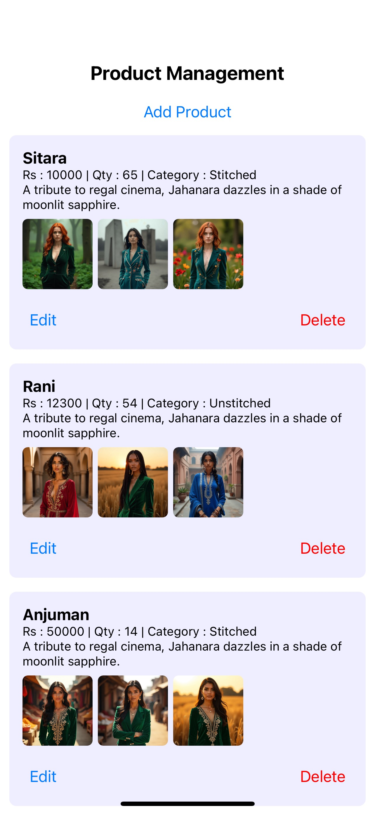

### ➕ Add Product

  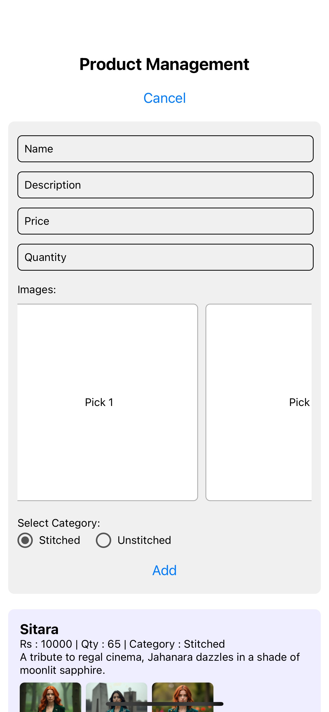

